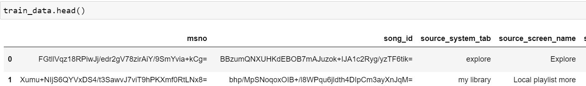
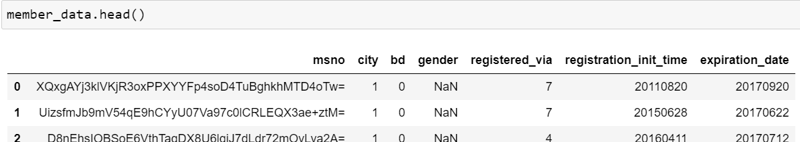
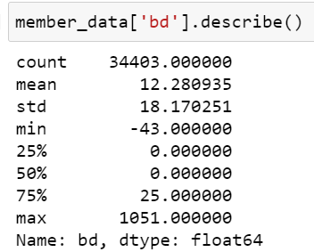

# Machine Learning Engineer Nanodegree
## Final Report
Ben Walsh  
February 14th, 2021

## Table of Contents

1. [Introduction](##introduction)
2. [Project Overview](##project-overview)
    - 2.1. [Problem Statement](###problem-statement)    
    - 2.2. [Datasets](###datasets)   
    - 2.3. [Benchmark Model](###benchmark-model) 
    - 2.4. [Evaluation Metrics](###evaluation-metrics)
3. [Data Pre-Processing](##data-pre-processing)
    - 3.1. [Data Exploration](###data-exploration)
    - 3.2. [Data Cleaning](###data-cleaning)
    - 3.3. [Feature Engineering](###feature-engineering)
    - 3.4. [Feature Selection](###feature-selection)
4. [Algorithm Implementation](##algorithm-implementation)
5. [Discussion](##discussion)

## Introduction

Music recommendation algorithms have powered the growing dominance of audio streaming applications, despite constantly changing content and the inherently subjective nature of any art. While established artists and engaged users can provide sufficient historical data to enable a machine learning solution, there are challenges for an algorithm to predict the preferences for a new user or a new artist. Personal curation by a human is not scalable for a massive user base, so in order for online applications to efficiently scale while growing engagement with users, an automated algorithm is critical.

## Project Overview

### Problem Statement

Given a song-user pair, the algorithm predicts whether a user will like it or not, as evidenced by a recurring listening event, i.e. listening to the song a certain number of times within a certain time window. The target value for a song-user pair is 1 or 0, representing whether a recurring listening event occured. Overall algorithm performance is evaluated on a test set of many user-song pairs, resulting in a single aggregate percent correct.

### Datasets

The datasets originate from a Kaggle competition: [WSDM - KKBox's Music Recommendation Challenge](https://www.kaggle.com/c/kkbox-music-recommendation-challenge/overview)

The primary training data contains: 
- msno: user id
- song_id: song id
- source_system_tab: the name of the tab where the event was triggered
- source_screen_name: name of the layout a user sees
- source_type: an entry point a user first plays music on mobile apps
- target: the target variable. target=1 means there are recurring listening event(s) triggered within a month after the user’s very first observable listening event, target=0 otherwise 

Additional information on users are also available, which can be linked with msno (user id):
- msno
- city
- bd: age
- gender
- registered_via: registration method
- registration_init_time: format %Y%m%d
- expiration_date: format %Y%m%d

Additional information on songs are also available, which can be linked with the song_id:
- song_id
- song_length: in ms
- genre_ids: genre category. Some songs have multiple genres 
- artist_name
- composer
- lyricist
- language

### Benchmark Model

As is typical for Kaggle competitions, there is a [leaderboard](https://www.kaggle.com/c/kkbox-music-recommendation-challenge/leaderboard) displaying the top performing submissions and [notebooks](https://www.kaggle.com/c/kkbox-music-recommendation-challenge/notebooks) which can be upvoted for relevancy and usefulness. 

The top score on an unknown test set is 0.747, with the top 10% scoring at 0.692 and a median submission of 0.671. While it is impossible to know how much experience the top submissions had and how much time they put into their solution, the initial goal was to generate a solution that would score in the top half, or above 0.671 on the test set. Specifically, the solution is compared against benchmark performance by evaluating on a test set of many user-song pairs, resulting in a single aggregate percent correct.

Since the highest performing submissions have unknown approaches, the upvoted notebooks will be a proxy to benchmark models. [This notebook](https://www.kaggle.com/terminate9298/music-recommandation-system) has been upvoted and has a respectable score of 0.68138 (most are not public), which is above the median. The algorithm in the notebook is from [LightGBM](https://lightgbm.readthedocs.io/en/latest/), a gradient boosting framework that uses tree based learning algorithms. Hyper-parameters in this solution to help compare to another tree-based approach are num_leaves: 108 and max_depth: 10.

### Evaluation Metrics

The solution is compared against the benchmark models by evaluating the aggregate accuracy on a test set which the model has not trained on. 

## Data Pre-Processing

The full solution to the music recommendation challenge encompassed data exploration, data cleaning, feature engineering, feature selection, and algorithm implementation. 

### Data Exploration

The training data, member data, and song data were all received as separate files. Before merging into a single feature input, each dataset was explored.

#### Training Data

The raw training data exhibits ID columns `msno` and `song_id` that were used to link with the member and song data, respectively, then dropped from the feature list since the underlying values are not informative. The remaining columns `source_system_tab`, etc. contain string values, which motivated either dropping or one-hot encoding the variables into interpretable numerical inputs.

#### Member Data

The raw member data contains ID column `msno`, used to link with the raw training data. The `city` and `registered_via` values are numerical but categorical, which motivated one-hot encoding. The `bd` and `gender` values displayed unexpected values, with `gender` showing over 50% of data as `NaN`, and `bd` (age) values summarized below: 

Seeing a negative minimum value and a maximum value of over 1000 motivated cleaning, where the outlier values were replaced with non-outlier mean.

The time and date-based variables are correctly expressed as meaningful numerical values. 

#### Song Data

Explored the song data...
Well-balanced target values in training set...
Note on song genre data...
Any visuals? Histograms on song language, user age, user city, ... 

The raw song data contains ID column `song_id`, used to link with the raw training data. ... 

The columns `artist_name`, etc. contain string values, which motivated either dropping or one-hot encoding the variables into interpretable numerical inputs.

The numerical columns `genre_ids` and `language` are IDs, which motivated one-hot encoding into interpretable numerical inputs.

The `song_length` is correctly expressed as a meaningful numerical value. 

### Data Cleaning

In order for the raw input data to be suitable for machine learning algorithms, [categorical data](####categorical-data), missing data, and outliers were all addressed, as detailed below.

#### Categorical Data

Several variables are encoded as numerical IDs and are categorical in nature. For machine learning algorithms to properly predict the ID, the values are one-hot encoded to new columns corresponding to each class. The following processing is applied:

    def dataframe_one_hot_encode(dataframe, feature):
        # Generate encoding
        oh_encoding = pd.get_dummies(dataframe[feature])

        # Concatenate new columns to dataframe
        dataframe = pd.concat([dataframe, oh_encoding], axis=1)

        # Drop original feature
        dataframe = dataframe.drop(feature, axis=1)
        
        return dataframe

As identified in [Data Exploration - Training Data](####training-data), `source_system_tab` is a categorical variable that is encoded in a string ID, and therefore was one-hot encoded.

As identified in [Data Exploration - Song Data](####song-data), song `language` is a categorical variable that is encoded in a numerical ID, and therefore was one-hot encoded.

As identified in [Data Exploration - Member Data](####member-data), member `city` and `registered_via` are categorical variables that are encoded in numerical IDs, and therefore were one-hot encoded.

#### Missing Data

As identified in [Data Exploration - Member Data](####member-data), member `gender` has the majority of values missing. Gender is likely to be informative, so instead of dropping the entire feature, the missing values are converted to a `UNK` keyword. Then the three categories for gender are one-hot encoded into three separate features.

#### Outliers

As identified in [Data Exploration - Member Data](####member-data), member `bd` (age) has positive and negative outliers. The outlier values, defined as outside of 0 and 120 (years), are replaced with the mean value. The calculated mean of the non-outliers is approximately 28 years old. 

### Feature Engineering

Details, example, pseudocode on Feature Engineering step

I anticipate an unsupervised learning method such as k-means clustering will be helpful to categorize similar genres into a new feature: genre_group, which will have less unique entries compared to genre_id and should  lead to better predictions. 

### Feature Selection 

Only meaningful variables are input into an algorithm, removing variables such as IDs. 

To finalize the feature input data, first the separate tables for training information with labels, song information, and user information were joined. Song information was joined on `song_id`, and member information was subsequently joined with on `msno`. 

Only variables with interpretable numerical information are input as features to train on. Therefore `msno` and `song_id` were removed after joining, since the IDs are arbitrary and do not contain useful information for music recommendation. 

Additional features that were removed were `source_screen_name` and `source_type` from the training data, and `artist_name`, `composer` and `lyricist` from the song data. The excluded training features were not expected to be informative. The excluded song features, while they would be informative for a human expert, do not inherently provide information without additional context such as genre or language, which were already included as features. With so many unique values, one-hot encoding would not be feasible.

## Algorithm Implementation

### Baseline Model

I will explore a few approaches to supervised learning with binary classification. I would like to start with a simpler, interpretable algorithm such as [logistic regression](https://scikit-learn.org/stable/modules/generated/sklearn.linear_model.LogisticRegression.html). 

### Final Model

I will also compare this with a popular, more powerful, but less (directly) interpretable algorithm like [XGBoost](https://xgboost.readthedocs.io/en/latest/python/python_intro.html). My final solution will be based off of hyper-parameter tuning each approach and comparing the aggregate accuracy on a test set. I'll also compare the training times and interpretability. 

As is typical for Kaggle competitions, there is a [leaderboard](https://www.kaggle.com/c/kkbox-music-recommendation-challenge/leaderboard) displaying the top performing submissions and [notebooks](https://www.kaggle.com/c/kkbox-music-recommendation-challenge/notebooks) which can be upvoted for relevancy and usefulness. 

The top score on an unknown test set is 0.747, with the top 10% scoring at 0.692 and a median submission of 0.671. While it is impossible to know how much experience the top submissions had and how much time they put into their solution, I hope I can at least generate a solution that would score in the top half, or above 0.671 on the test set. Specifically, I will compare my solution to benchmark performance by evaluating on a test set of many user-song pairs, resulting in a single aggregate percent correct.

Since the highest performing submissions have unknown approaches, the upvoted notebooks will be a proxy to benchmark models. [This notebook](https://www.kaggle.com/terminate9298/music-recommandation-system) has been upvoted and has a respectable score of 0.68138 (most are not public), which is above the median. The algorithm in the notebook is from [LightGBM](https://lightgbm.readthedocs.io/en/latest/), a gradient boosting framework that uses tree based learning algorithms. Hyper-parameters in this solution to help compare to another tree-based approach are num_leaves: 108 and max_depth: 10.

### Optimization
### Evaluation Metrics

My solution is evaluated against the benchmark models by comparing the aggregate accuracy on a test set which the model has not trained on. In code:

    num_correct = (test_predictions == test_truth).sum()
    test_acc = num_correct / len(test_prediction)

## Discussion

### Refinement

Discussion on intermediate steps - what hyperparams were tuned, whaty were observations of how performance changed as data was processed

### Parameters

How do hyperparams (e.g. size of tree) compare to benchmark?

### Conclusion

Am I done? Justification when compared to benchmark

### Project Design

My intended approach to the capstone project entails data exploration, data cleaning, feature engineering, feature selection, algorithm implementation, and model evaluation.

#### Feature Engineering

In addition to the cleaned features, I expect additional engineered features will be valuable. For instance, genre_id is useful information, but clearly distinguishing each genre with individual IDs misses the intuition that certain genres are much more similar to each other than others. I expect an unsupervised learning method such as k-means clustering will be helpful to categorize similar genres into a new feature: genre_group, which will have less unique entries compared to genre_id and should  lead to better predictions. To implement the clustering, the library `sklearn.cluster` includes a `KMeans` library. I will explore a range of `n_clusters` to identify intuitive groupings. 

#### Algorithm Implementation

With clean feature data ready as input, I will explore a few approaches to the problem, which is a supervised learning, binary classification problem. I plan to start with a simpler, interpretable algorithm such as [logistic regression](https://scikit-learn.org/stable/modules/generated/sklearn.linear_model.LogisticRegression.html) which is available in `sklearn` under `linear_model.LogisticRegression`. I will also compare this with a popular, more powerful, but less (directly) interpretable algorithm like [XGBoost](https://xgboost.readthedocs.io/en/latest/python/python_intro.html), which is available under the `xgboost` library. My final solution will be based off of hyper-parameter tuning each approach and comparing the aggregate accuracy on a test set. I'll also compare the training times and interpretability. 

## Conclusions
